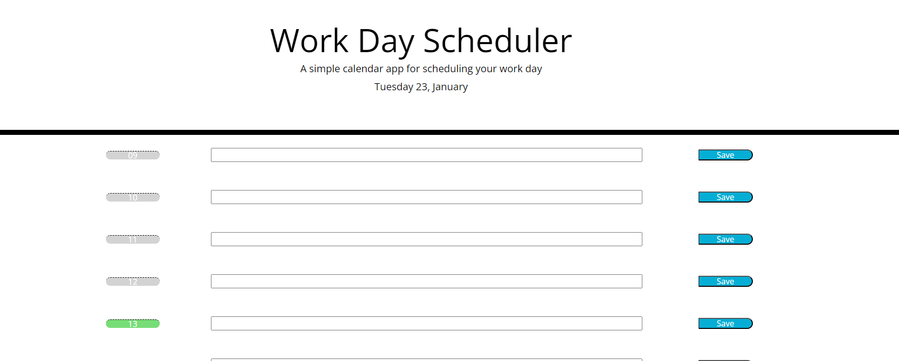
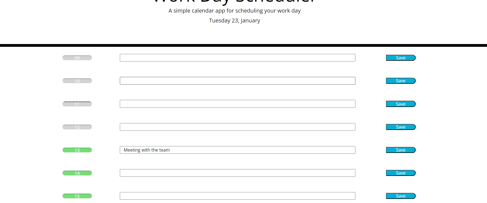

# Work-day-Scheduler

See site [here]()

## Overview

This project's requirement was to create a simple calendar application that will allowa user to save events for each working hour.

The time block hour section will dynamically change colour to demonstrate past events, current and future events. This is synched to users current time.

